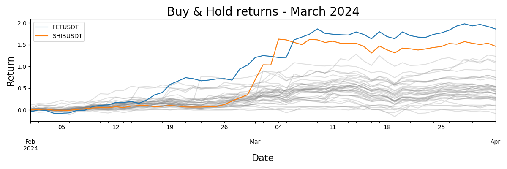
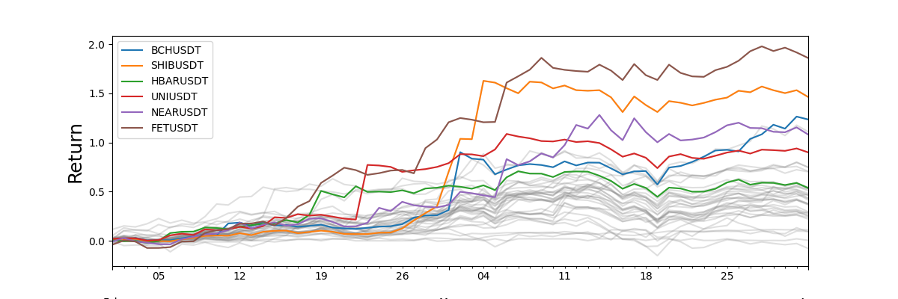
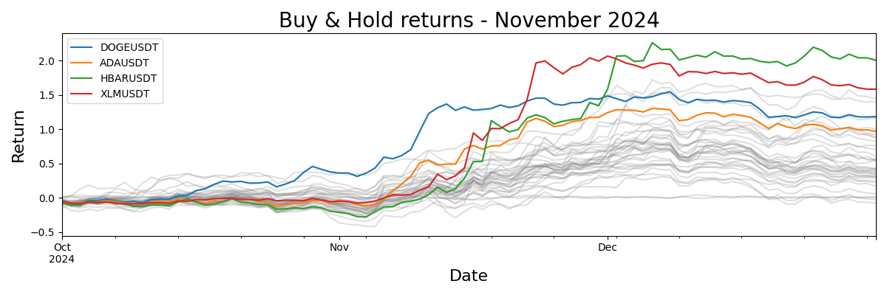
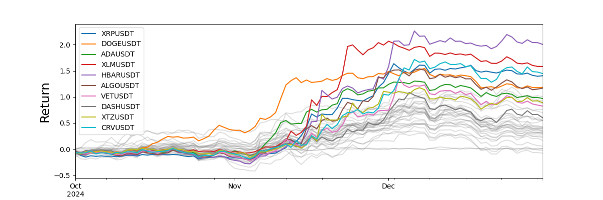
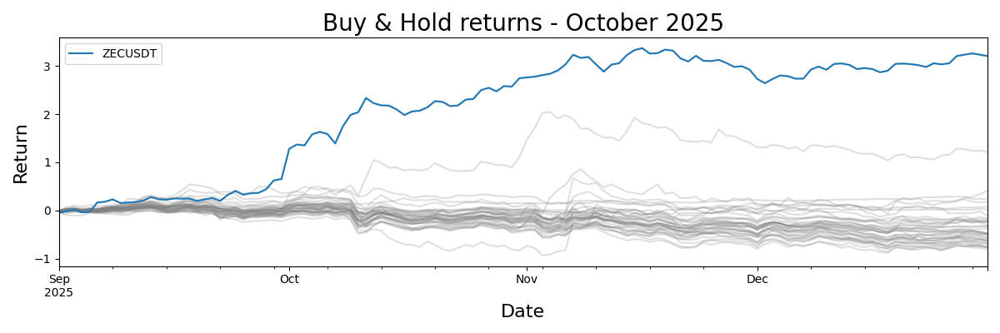
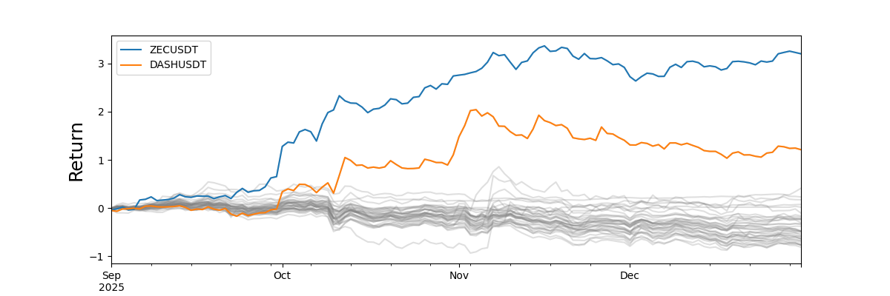

# Mixed Quant Strategies in Crypto Trading

## Overview

This strategy explores a mixture of models. For more detailed information, here are the [project slides](https://github.com/mrbrins82/quant-research-projects/blob/main/ensemble-models-crypto-strat/quant_ensemble_crypto_project.pdf) and [jupyter notebook](https://github.com/mrbrins82/quant-research-projects/blob/main/ensemble-models-crypto-strat/full_backtested_strats.ipynb) containing the backtest.

<u>__Models Used__</u>

1. A technical indicator strategy based on moving averages, momentum indicators, drawdown indicators, and some other engineered indicators.
2. A supervised ML model that classifies the next day returns, emphasizing for precision since false positives cost money.
3. An unsupervised ML model that clusters different regimes during bullish-bearish-neutral periods.

## Results

These strategies were trained from 2021-01-01 to 2023-12-31, and validated on data from 2024-01-01 to 2024-12-31. For the OOS testing which ran from 2025-01-01 to 2026-02-28, the strategies were weighted using various methods based on their performance during the validation period. The best performing overall strategy was the one that combined individual strategies based on their Sharpe Ratios during the validation period. 

<u>__Overall Strategy Results__</u>

* __Sharpe Ratio: 1.979__
* __$\alpha$ t-stat: 2.126__
* __$\alpha$: 0.0009__
* __Information Ratio: 1.03__

## Notes on Technical Strategy

As can be seen in the project slides, the technical strategy exhibits periods of flatness with short periods of large returns. Ideally, a strategy with continual gains rather than sudden large gains would be preferred. There are three times during the validation and OOS periods where the strategy makes its gains. These occur in March 2024, November 2024, and October 2025.

From the following plots, the technical indicator strategy seems adept at capturing gains when coins exhibit momentum on the order of weeks. However, this strategy sees negligible results during other times. As a next step, further investigation into new technical indicators, and refinement of current indicators could potentially lead to steadier gains.

### March 2024
The first plot shows the Buy & Hold returns for each individual coin with FETUSDT and SHIBUSDT highlighted specifically. The second plot shows the gains made by the technical indicator strategy, again highlighting FETUSDT and SHIBUSDT. We can see that this is a period where all coins see an increase in price, to varying degrees. The strategy picks up on the sharp increases in FETUSDT and SHIBUSDT, while ignoring the more shallow price increases of the other coins.

### November 2024
For November 2024, we again have the first plot showing the individual Buy & Hold returns for each coin, with DOGEUSDT, ADAUSDT, HBARUSDT, and XLMUSDT highlighted. The second plot shows the returns made by the technical indicator strategy during the same period with the same coins highlighted. We see here another example of increasing prices for all coins to varying degrees, but a strategy that picks up on a handful of coins that exhibit steeper increases in price, while ignoring those that have a shallower increase.

### October 2025
October 2025 is different from the previous two periods, in that during this time all but a couple coins decreased in value. The strategy only picks up on the sharp increase in price for ZECUSDT, and again ignores coins with shallower price movements.

